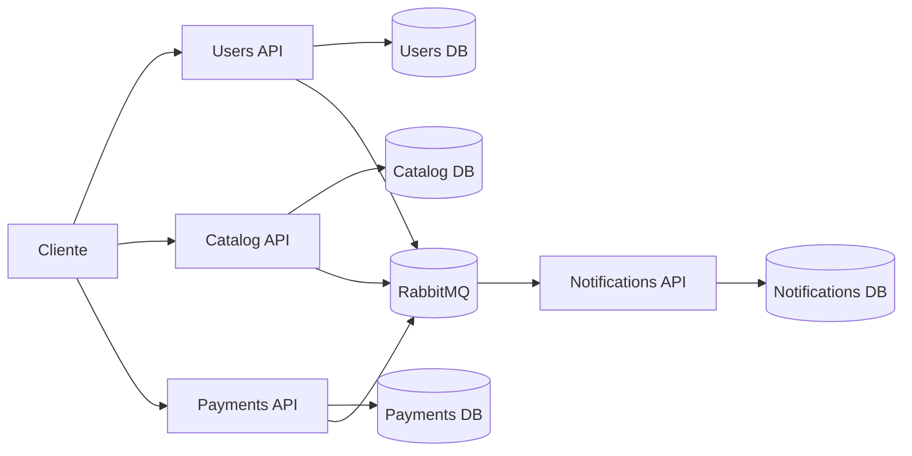

# Arquitetura

O FCG sera organizado em microsservicos independentes, cada um com seu proprio banco de dados. A comunicacao assincroma entre servicos sera feita por RabbitMQ.

## Visao geral

## Decisoes iniciais

- Cada API tera seu proprio banco para evitar acoplamento por dados.
- RabbitMQ sera o broker de eventos para reduzir chamadas diretas entre microsservicos.
- Docker Compose sera usado primeiro para validar localmente.
- Kubernetes sera usado para demonstrar `Deployment`, `Service`, `ConfigMap` e `Secret`.

## Nomes internos no Kubernetes

Dentro do cluster, os servicos devem usar DNS interno:

- `rabbitmq`
- `users-db`
- `catalog-db`
- `payments-db`
- `notifications-db`
- `users-api`
- `catalog-api`
- `payments-api`
- `notifications-api`

Por isso, dentro de containers no Kubernetes, connection strings usam `Server=users-db,1433` e nao `localhost`.
